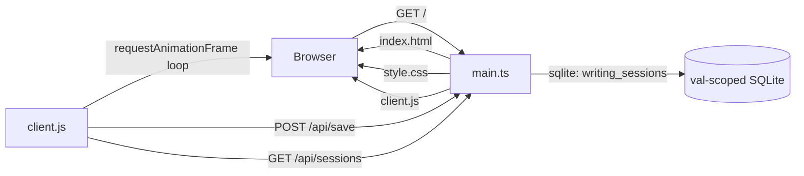

# Dangerous Writing App

A free-writing forcing function: set a goal of **N minutes** and an allowed silence of **M seconds**. Start writing — if you stop typing for longer than M seconds, your text begins to **decay and erase itself**. Survive to the time goal and your words are safe. Stall out and the void eats everything.

Inspired by the classic "dangerous writing" prompt.

## How to play

1. Set **Minutes (N)** — how long you want to write.
2. Set **Inactivity Seconds (M)** — how long you're allowed to pause.
3. Click **Start** and keep typing. Don't stop.

## Saving your writing

When a run ends (you survive, the text is erased, or you stop early), whatever is on the page is **saved automatically**:

1. **Browser (`localStorage`)** — every finished session is stored under `dangerous-writing:last`, so it survives page reloads on this device. Works for anyone, signed in or not.
2. **Val Town SQLite** — if you're **signed in to val.town**, the text is also **backed up to this val's database** via `POST /api/save` (keyed by your Val Town user id). The **Restore last writing** button pulls the most recent session back — from `localStorage` first, falling back to your synced sessions (`GET /api/sessions`) when the local copy is missing.

### Signing in

A **Sign in to back up to Val Town** button sits under the header. It uses Val Town's [zero-config OAuth](https://esm.town/v/std/oauth) (`std/oauth`): the button opens a login popup, and after you authorize, the page refreshes its sign-in state and your finished writing is backed up to this val's SQLite (`writing_sessions` table, indexed by your user id) and restoreable from any browser where you're signed in.

After a run ends the editor becomes **read-only (not disabled)**, so the text stays selectable, and a **Copy text** button copies the whole session to your clipboard.

## Files

```
main.ts       HTTP handler — serves the page, static assets, and /api/save + /api/sessions
index.html    Markup
style.css     Styles
client.js     Game logic (timer, idle detection, text decay) + persistence & copy
```

## Architecture



The game itself runs client-side; the server serves static files, and — for signed-in visitors — persists finished writing sessions into the val's SQLite database (`writing_sessions` table, indexed by user id).
